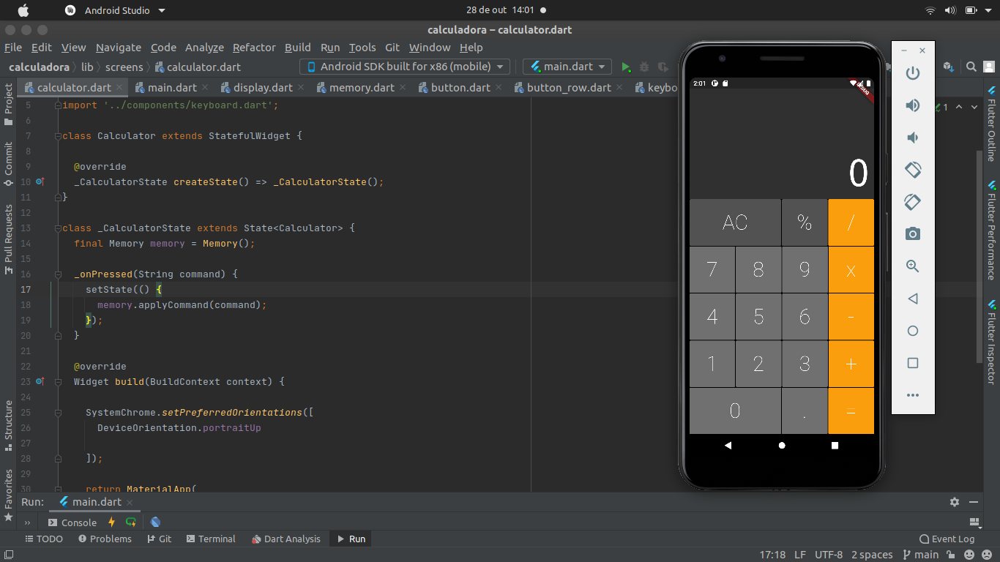

# Calculadora 
É um projeto simples de uma calculadora, feito para fazer calculos matematicos. A aplicaçao foi desenvolida com flutter, e a esta faz operaçao deadiçao, subtraçao, multiplicaçao e divisao.

## Preview

<h1 align="center">
    
</h1>

## Tecnologias

- Flutter